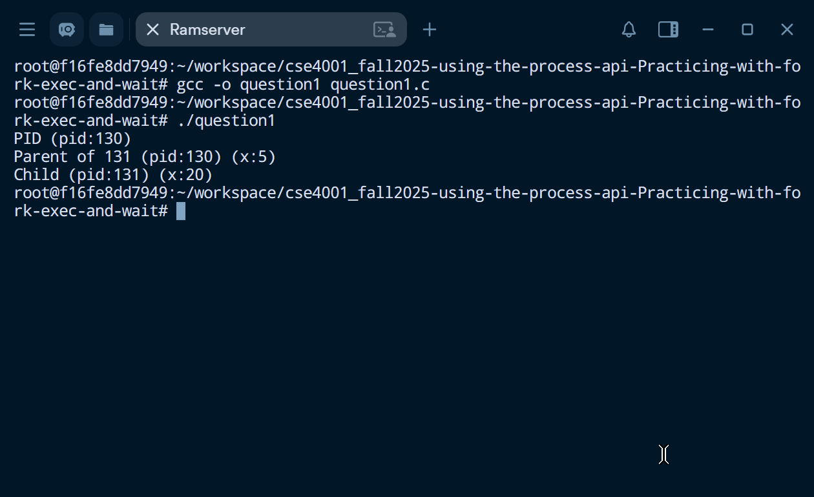
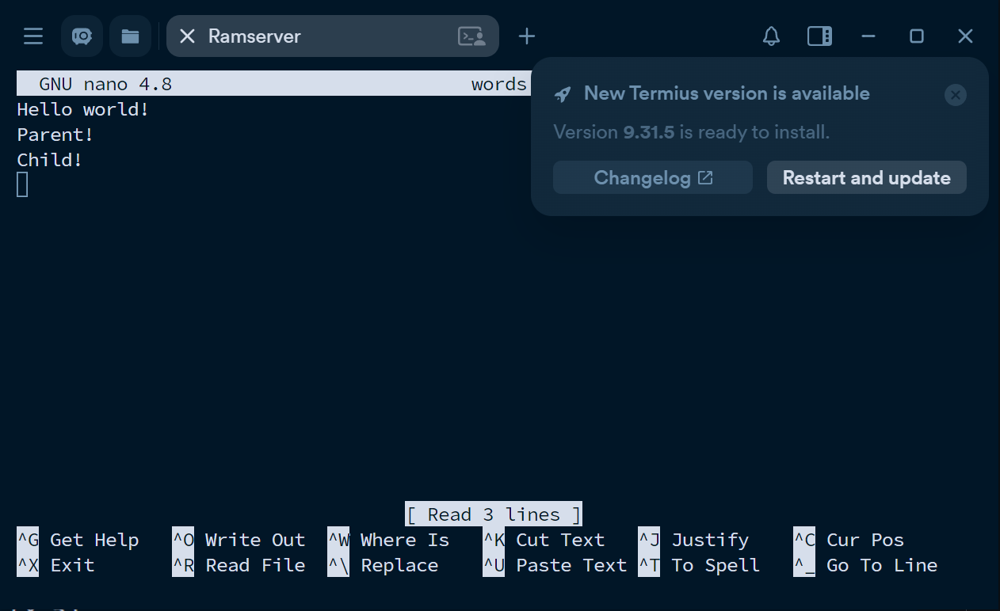
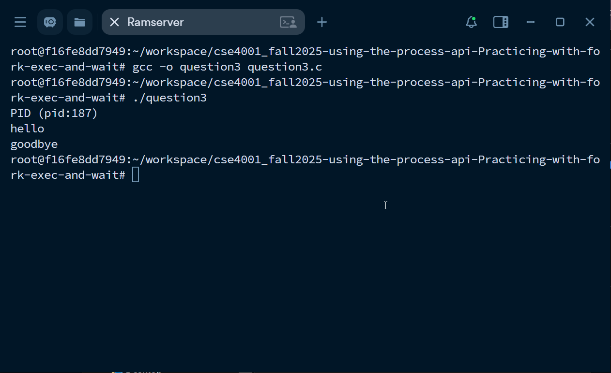
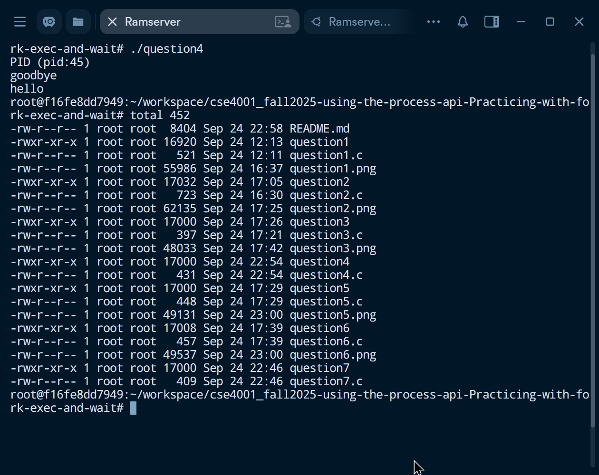
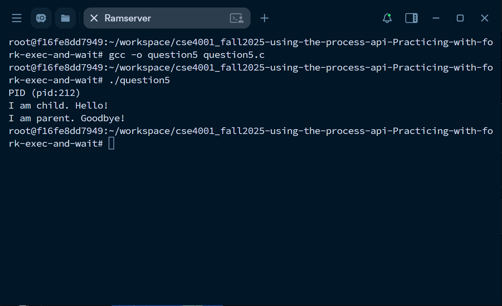
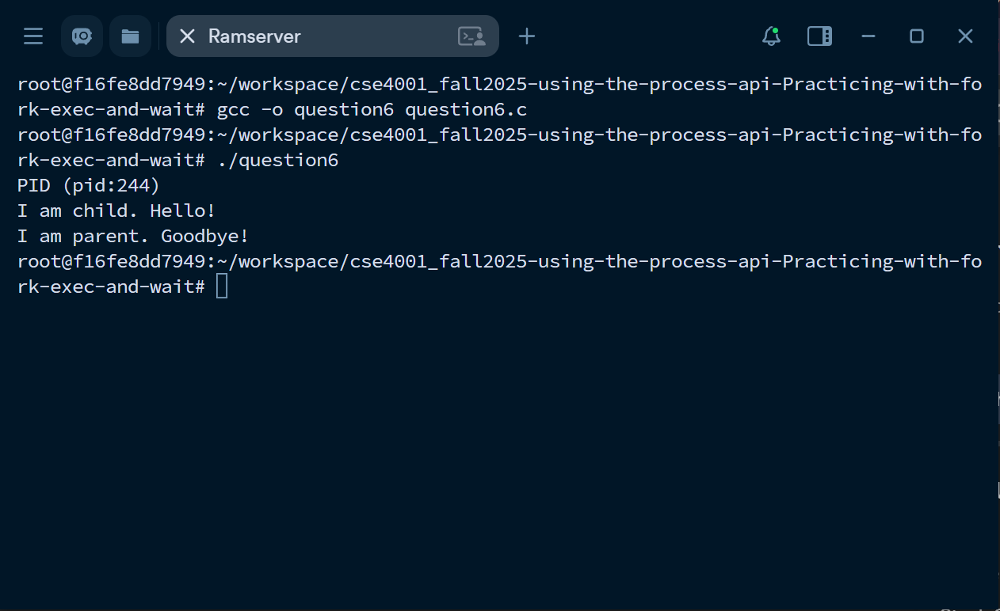
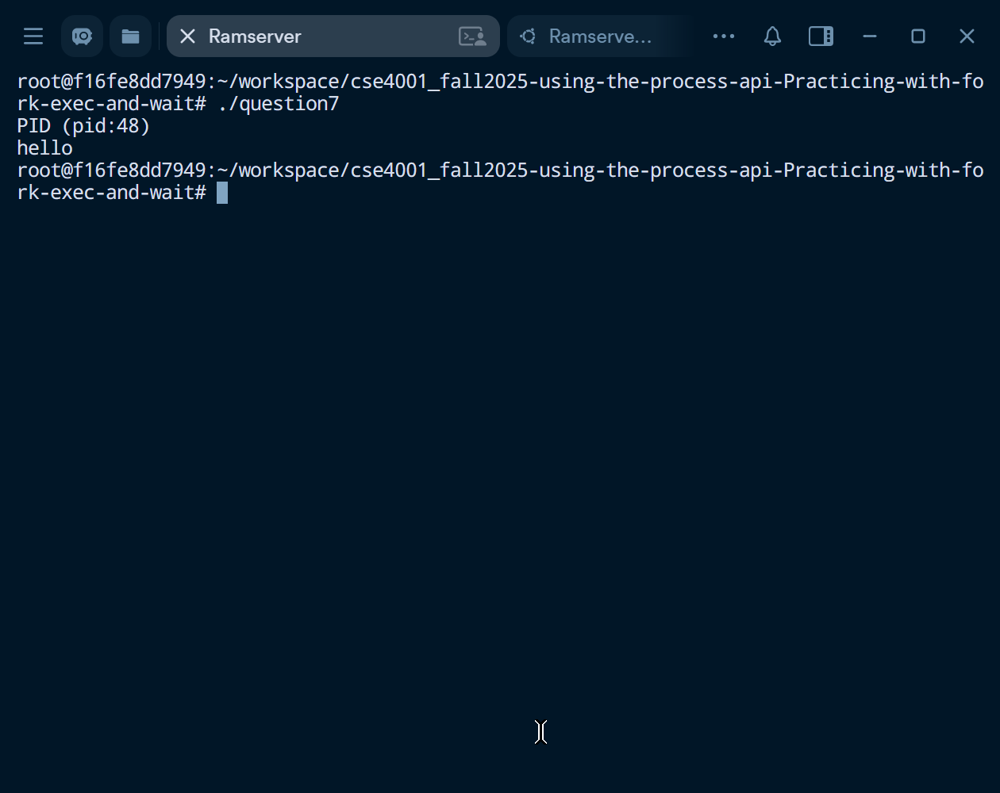

# Assignment: Practicing the Process API
Practicing with fork, exec, wait. 

### Overview

In this assignment, you will practice using the Process API to create processes and run programs under Linux. The goal is to gain hands-on experience with system calls related to process management. Specifically, you will practice using the unix process API functions 'fork()', 'exec()', 'wait()', and 'exit()'. 

⚠️ Note: This is not an OS/161 assignment. You will complete it directly on Linux. 

Use the Linux in your CSE4001 container. If you are using macOS, you may use the Terminal (you may need to install development tools with C/C++ compilers). 

**Reference Reading**: Arpaci-Dusseau, *Operating Systems: Three Easy Pieces*, Chapter 5 (Process API Basics)
 👉 [Chapter 5 PDF](http://pages.cs.wisc.edu/~remzi/OSTEP/cpu-api.pdf)

---

### **Steps to Complete the Assignment**

1. **Accept the GitHub Classroom Invitation**
    [GitHub Link](https://classroom.github.com/a/FZh4BrQG)
2. **Set up your Repository**
   - Clone the assignment repository.
3. **Study the Reference Materials**
   - Read **Chapter 5**.
   - Download and explore the sample programs from the textbook repository:
      [OSTEP CPU API Code](https://github.com/remzi-arpacidusseau/ostep-code/tree/master/cpu-api).
4. **Write Your Programs**
   - Adapt the provided example code to answer the assignment questions.
   - Each program should be clear, well-commented, and compile/run correctly.
   - Add your solution source code to the repository.

5. **Prepare Your Report**
   - Answer the questions in the README.md file. You must edit the README.md file and not create another file with the answers. 
   - For each question:
     - Include your **code**.
     - Provide your **answer/explanation**.
6. **Submit Your Work via GitHub**
   - Push both your **program code** to your assignment repository.
   - This push will serve as your submission.
   - Make sure all files, answers, and screenshots are uploaded and rendered properly.


---
### Questions
1. Write a program that calls `fork()`. Before calling `fork()`, have the main process access a variable (e.g., x) and set its value to something (e.g., 100). What value is the variable in the child process? What happens to the variable when both the child and parent change the value of x?


- The variable's value in the child process is identical to that of the parent's value. However, each process has it's own copy of the variable, so changing the value in either process does not affect the other.
```cpp  
#include <stdio.h>
#include <stdlib.h>
#include <unistd.h>

int main(void) {
    printf("PID (pid:%d)\n", (int) getpid());
    int x = 10;
    int id = fork();

    if (id < 0) { // id is negative; failed
        fprintf(stderr, "Failed\n");
        exit(1);
    } else if (id == 0) { // is child
        x = x+10; // x = 20
        printf("Child (pid:%d) (x:%d)\n", (int) getpid(), x);
    } else { // is parent
	x = x-5; // x = 5
        printf("Parent of %d (pid:%d) (x:%d)\n", id, (int) getpid(), x);
    }

    return 0;
}
```


2. Write a program that opens a file (with the `open()` system call) and then calls `fork()` to create a new process. Can both the child and parent access the file descriptor returned by `open()`? What happens when they are writing to the file concurrently, i.e., at the same time?
- Yes, both the parent and child can access the file descriptor when it is declared before forking.
- They can also write to the same file concurrently. The order of written data depends on the order of execution between these processes.
```cpp
#include <stdio.h>
#include <stdlib.h>
#include <unistd.h>
#include <string.h>
#include <fcntl.h>

int main(void) {
    printf("PID (pid:%d)\n", (int) getpid());
    int file = open("words.txt", O_RDWR);
    char *start = "Hello world!\n";
    write(file, start, strlen(start));
    int id = fork();

    if (id < 0) { // id is negative; failed
        fprintf(stderr, "Failed\n");
        exit(1);
    } else if (id == 0) { // is child
        char *text = "Child!\n";
        write(file, text, strlen(text));
        printf("Child (pid:%d)\n", (int) getpid());
    } else { // is parent
        char *text = "Parent!\n";
        write(file, text, strlen(text));
        printf("Parent of %d (pid:%d)\n", id, (int) getpid());
    }

    return 0;
}
```


3. Write another program using `fork()`.The child process should print “hello”; the parent process should print “goodbye”. You should try to ensure that the child process always prints first; can you do this without calling `wait()` in the parent?
- Yes, you can implement a delay with sleep(). However, this timing can be inaccurate and cause waiting longer than necessary.
```cpp
#include <stdio.h>
#include <stdlib.h>
#include <unistd.h>

int main(void) {
    printf("PID (pid:%d)\n", (int) getpid());
    int id = fork();

    if (id < 0) { // id is negative; failed
        fprintf(stderr, "Failed\n");
        exit(1);
    } else if (id == 0) { // is child
        printf("hello\n");
    } else { // is parent
        sleep(1); // ensures that parent prints last
        printf("goodbye\n");
    }

    return 0;
}
```


4. Write a program that calls `fork()` and then calls some form of `exec()` to run the program `/bin/ls`. See if you can try all of the variants of `exec()`, including (on Linux) `execl()`, `execle()`, `execlp()`, `execv()`, `execvp()`, and `execvpe()`. Why do you think there are so many variants of the same basic call?
```cpp
#include <stdio.h>
#include <stdlib.h>
#include <unistd.h>

int main(void) {
    printf("PID (pid:%d)\n", (int) getpid());
    int id = fork();

    if (id < 0) { // id is negative; failed
        fprintf(stderr, "Failed\n");
        exit(1);
    } else if (id == 0) { // is child
        printf("hello\n");
        execl("/bin/ls", "ls", "-l", (char *)NULL);
    } else { // is parent
        printf("goodbye\n");
    }

    return 0;

```


5. Now write a program that uses `wait()` to wait for the child process to finish in the parent. What does `wait()` return? What happens if you use `wait()` in the child?
- wait() returns the PID of the completed child process.
```cpp
#include <stdio.h>
#include <stdlib.h>
#include <unistd.h>
#include <sys/wait.h>

int main(void) {
    printf("PID (pid:%d)\n", (int) getpid());
    int id = fork();

    if (id < 0) { // id is negative; failed
        fprintf(stderr, "Failed\n");
        exit(1);
    } else if (id == 0) { // is child
        printf("I am child. Hello!\n");
    } else { // is parent
        wait(NULL);
        printf("I am parent. Goodbye!\n");
    }

    return 0;
}
```


6. Write a slight modification of the previous program, this time using `waitpid()` instead of `wait()`. When would `waitpid()` be useful?
- waitpid() would be useful when there are multiple active children, of which there is only one child to wait for.
```cpp
#include <stdio.h>
#include <stdlib.h>
#include <unistd.h>
#include <sys/wait.h>

int main(void) {
    printf("PID (pid:%d)\n", (int) getpid());
    int id = fork();

    if (id < 0) { // id is negative; failed
        fprintf(stderr, "Failed\n");
        exit(1);
    } else if (id == 0) { // is child
        printf("I am child. Hello!\n");
    } else { // is parent
        waitpid(0, NULL, 0);
        printf("I am parent. Goodbye!\n");
    }

    return 0;
}
```


7. Write a program that creates a child process, and then in the child closes standard output (`STDOUT FILENO`). What happens if the child calls `printf()` to print some output after closing the descriptor?
- Any calls of printf() after closing standard output fail, and do not print anything.
```cpp
#include <stdio.h>
#include <stdlib.h>
#include <unistd.h>

int main(void) {
    printf("PID (pid:%d)\n", (int) getpid());
    int id = fork();

    if (id < 0) { // id is negative; failed
        fprintf(stderr, "Failed\n");
        exit(1);
    } else if (id == 0) { // is child
        printf("hello\n");
    } else { // is parent
        close(STDOUT_FILENO);
        printf("goodbye\n");
    }

    return 0;
}
```


